#+title: Writeup - Fruityloops EchoCTF
#+author: mrtaichi
#+OPTIONS: toc:2
#+PROPERTY: header-args :exports both
#+LATEX_CLASS: article
#+LATEX_CLASS_OPTIONS: [11pt, letterpaper]
#+LATEX_HEADER: \usepackage[margin=2.5cm]{geometry}      % Márgenes decentes
#+LATEX_HEADER: \usepackage[utf8]{inputenc}
#+LATEX_HEADER: \usepackage{palatino}                   % Tipografía elegante
#+LATEX_HEADER: \usepackage{xcolor}                     % Colores personalizados

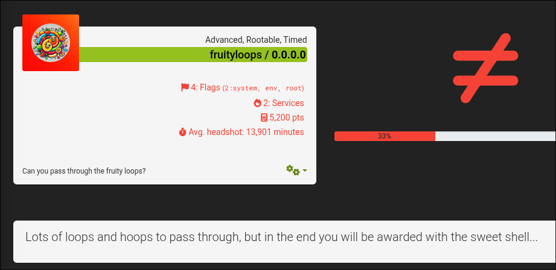
** Información General

-  **Nombre de la Máquina**: fruityloops
-  **Plataforma**: echoCTF
-  **Dificultad**: Medio
-  **Sistema Operativo**: Linux
-  **Fecha**: 2026-06-03
-  **Autor**: mrtaichi

** Descripción de la máquina
  Lots of loops and hoops to pass through, but in the end you will be awarded with the sweet shell...

** Enumeración

*** Escaneo Inicial

  Inmediatamente probamos entrar por http a la máquina a ver que nos encontramos. De esta forma, encontramos directamente una página web a la cual por más que le rasquemos no vamos a encontrar mucho. Esto porque es simplemente una plantilla HTML que no nos da nada.

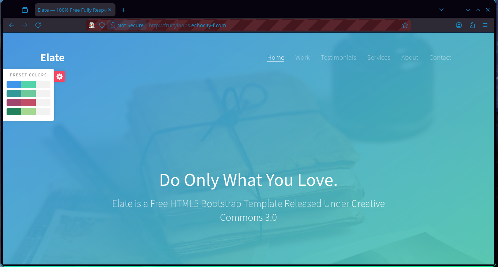

*** Análisis de Servicios

  Ya tenemos 1/2 servicios identificados. El otro es un SSH que identificamos cuando corremos un nmap sobre la máquina.

De una vez también hacemos un dirsearch para ver qué nos podemos topar.

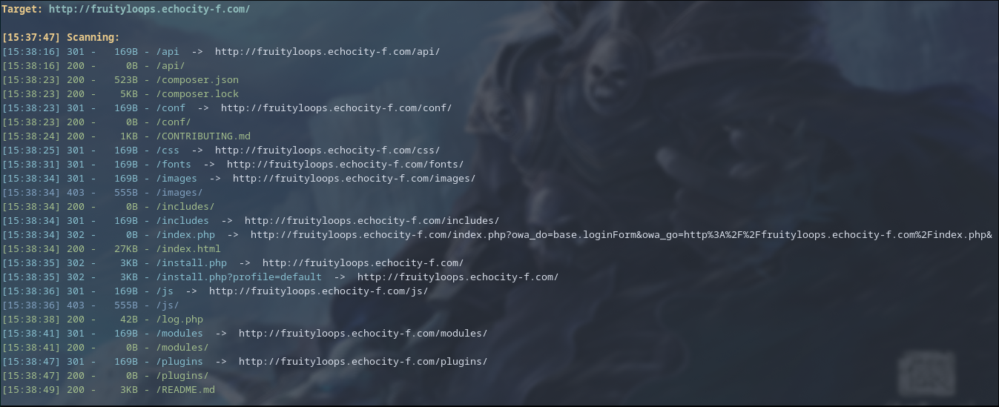

En este dirsearch nos podemos topar varias cosillas ya bastante interesantes. Pero lo más interesante y a donde debemos de dirigir nuestra atención son dos cosas:

- Tenemos un index.php, generalmente un index.php nos da más lógica explotable que el index.html al que tenemos acceso.

- Tenemos un README.md

En el README encontramos la descripción de un servicio llamado Open Web Analytics, y de hecho el index.php es el admin panel del mismo.

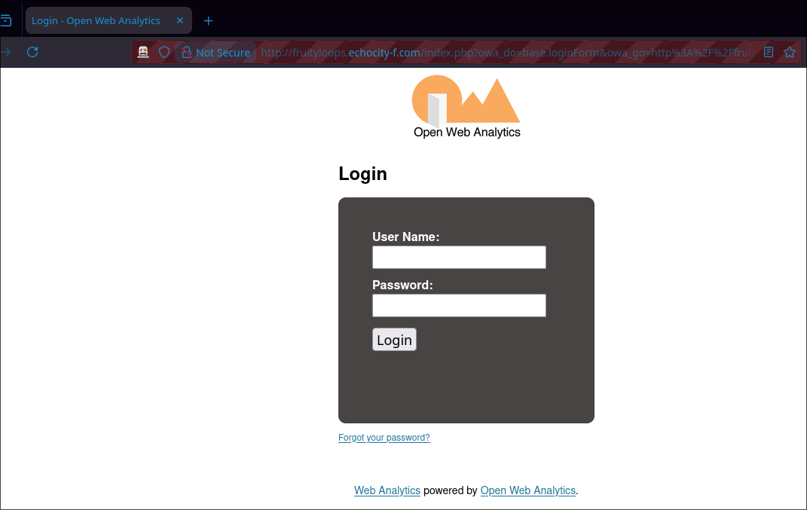

** Explotación

*** Busqueda de vulnerabilidades

  Si googleamos Open Web Analytics, nos encontramos directamente con una vulnerabilidad relacionada con Remote Code Execution. Esto nos sirve.

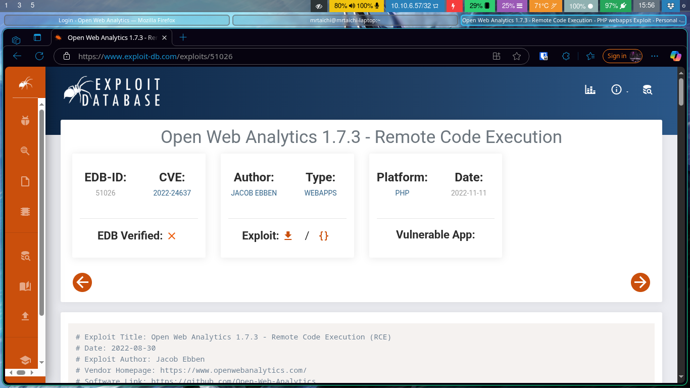

*** Intentos de explotaciones
  Si intentamos correr el script directamente vamos a tumbar la máquina, entonces debemos de realizar algunos cambios.

 El primero y el más directo es cambiar el payload que crea la reverse shell, esto porque utiliza sockets; y las máquinas de echoCTF no admiten el uso de sockets para levantar revshells. Así que usemos netcat para esto.

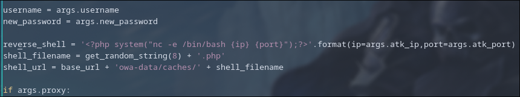

En la linea 100 cambiamos el payload para que sea un php que use ese comando simplemente. Con esto, el payload puede funcionar correctamente.

El segundo cambio que vamos a realizar es relacionado a la forma en que funciona la vulnerabilidad:

La vulnerabilidad se sirve de crear un archivo log el cual puede ser un php interpretable. El problema con el exploit es que asume que los logs se crean en /var/www/html/owa/owa-data/caches/. Esto no es correcto en el contexto de esta máquina. Para ver la ruta real, debemos de bypassear el panel de admin con las primeras partes del exploit y meternos a manita para ver la ruta real.

Para esto, comentamos todo después de la linea 204:

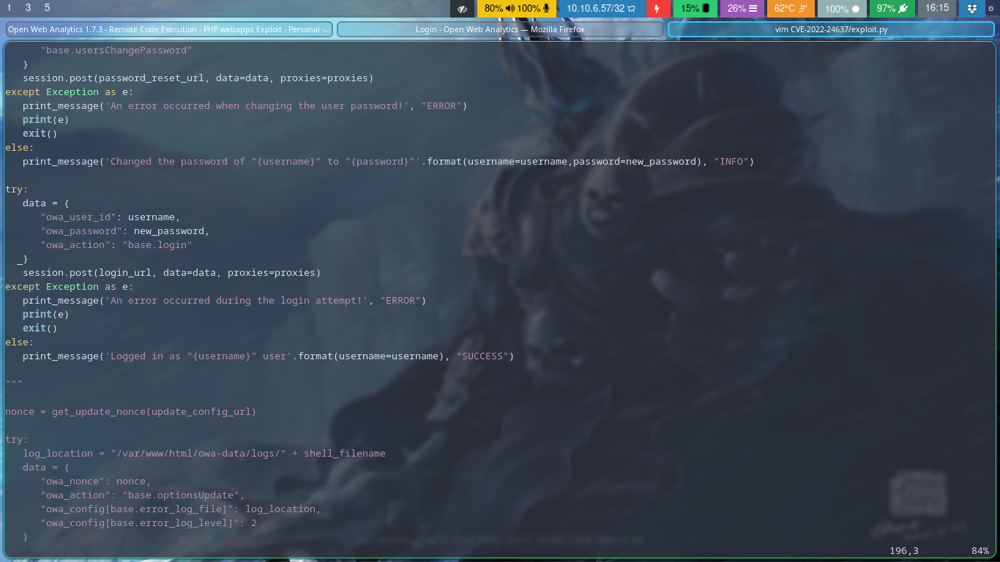

Con esto corremos el script solamente para cambiar la contraseña del admin y poder acceder

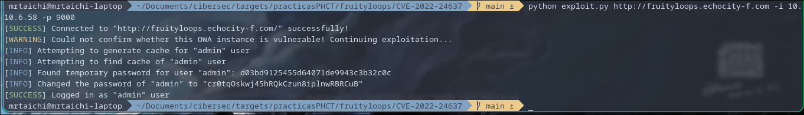

*** Explotación
 Al entrar a la sección de Settings -> Main Configuration nos encontramos bajo la sección de eventos la ruta real a la que vamos a guardar los logs, la cual es /var/www/html/owa-data/logs

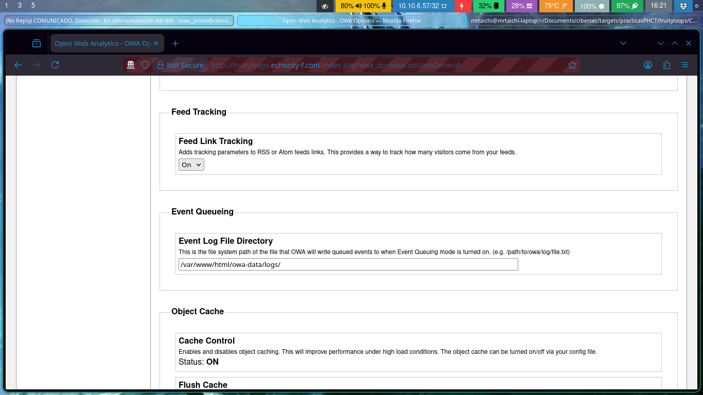

Es a esta ruta a la que debe apuntar nuestro script. La usamos en dos ámbitos: para guardar el log y para activarlo.

Para corregir el script, corregimos esta ruta en dos lugares clave:

En la variable log_location, alrededor de la linea 209

Y en la variable shell_url, alrededor de la línea 102:

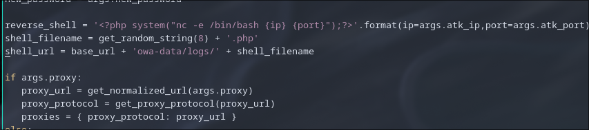

Con estos cambios, podemos descomentar la última sección del script, poner a nuestro manejador de revshells predilecto a la escucha y correr el script.

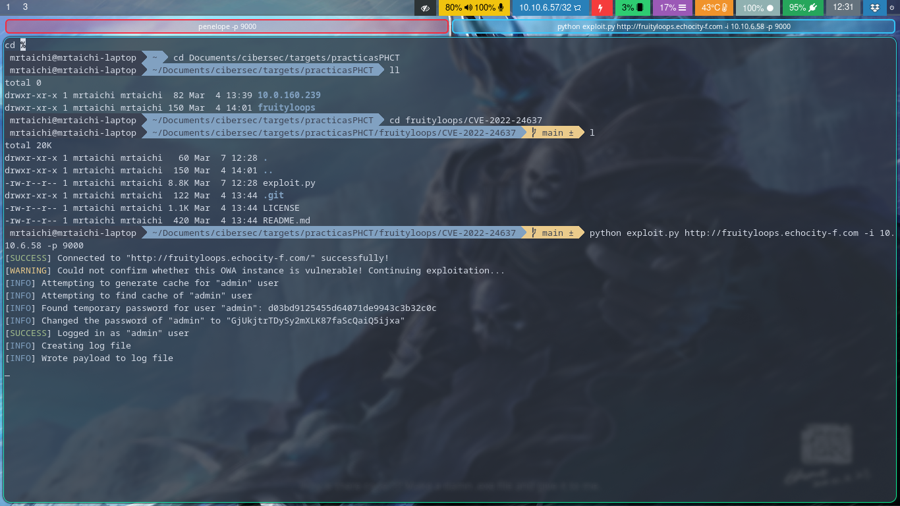

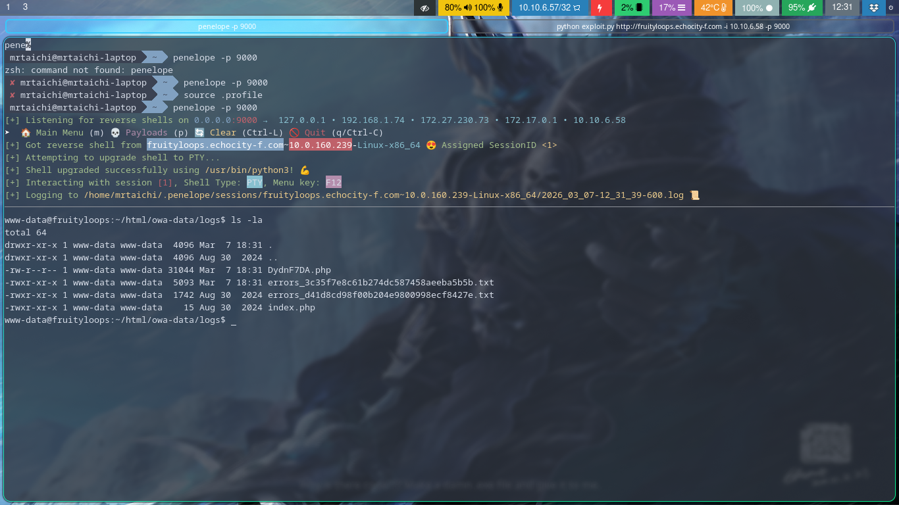

Y estamos dentro

** Escalación de Privilegios

*** Análisis

 Entramos a la máquina como el usuario www-data (típico de máquinas de EchoCTF).

Mi regla de dedo es siempre correr sudo -l antes que nada, para ver si podemos correr algún binario con permisos de root ya desde ahora. Y efectivamente, tenemos un script en Javascript que podemos correr con sudo sin contraseña

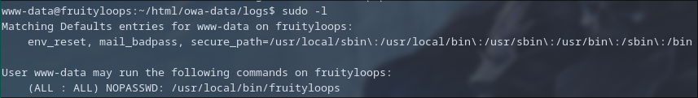

El cual me huele a un Prototype Pollution de manual.

Y efectivamente, si googleamos la única biblioteca que utiliza este script (apphp/object-resolver), podemos encontrar una vulnerabilidad de Prototype Pollution, cuyo ejemplo es extremadamente parecido al código que tenemos en el script.

https://gist.github.com/mestrtee/c90189f3d8480a5f267395ec40701373

*** Explotación

El **Prototype Pollution** ocurre cuando una aplicación permite a un atacante modificar el prototipo de un objeto base (normalmente `Object.prototype`). En JavaScript, casi todos los objetos heredan propiedades de este prototipo.

En el código de `/usr/local/bin/fruityloops`, observamos lo siguiente:

1.  Se define un objeto vacío `var authentication = {}`.

2.  Se utiliza la función vulnerable `lib.setNestedProperty({}, args[0], true)`.

3.  Se verifica si `authentication.success === true`.

Normalmente, `authentication.success` sería `undefined` porque el objeto está vacío. Sin embargo, si logramos "contaminar" el prototipo global de los objetos, cualquier objeto nuevo (incluyendo `authentication`) heredará la propiedad que nosotros definamos.

La biblioteca `@apphp/object-resolver` no sanitiza la llave que se le pasa en el primer argumento. Si enviamos el string `__proto__.success`, la función no modificará el objeto temporal `{}`, sino que subirá en la jerarquía hasta el objeto raíz y le asignará el valor `true` a la propiedad `success`.

El script intenta ejecutar un binario en `/tmp/pwned`. Como somos `www-data`, tenemos permisos de escritura en `/tmp`, así que creamos un script que nos devuelva una shell con privilegios:

#+begin_src bash
# Creamos el archivo que ejecutará el script de Node
echo -e '#!/bin/bash\nchmod +s /bin/bash' > /tmp/pwned

# Le damos permisos de ejecución
chmod +x /tmp/pwned

#+end_src

Ahora ejecutamos el binario con `sudo`. Al pasarle el string de contaminación como argumento, el `if` se volverá verdadero y el proceso ejecutará nuestro archivo en `/tmp` con los permisos de `sudo` (root).

#+begin_src bash
sudo /usr/local/bin/fruityloops "__proto__.success"
#+end_src

¡Y listo! Al ejecutarse, le damos SUID a /bin/bash y con eso, al ejecutarla con -p, podemos escalar a root.

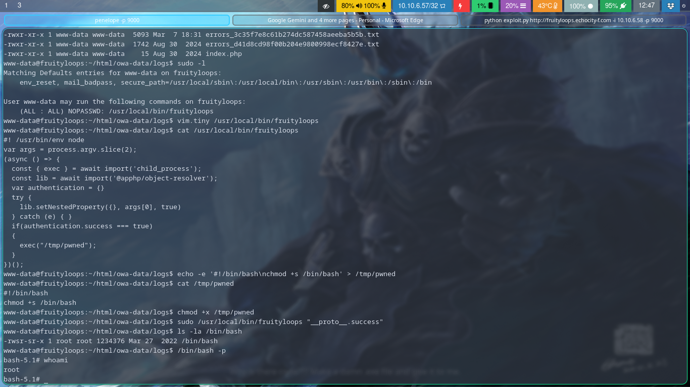

Una vez como root, solo queda buscar las flags.

- Dos de system: las de /etc/shadow y /etc/passwd
- La de env, en /proc/1/environ
- La de root, el archivo en /root

**HEADSHOT**
